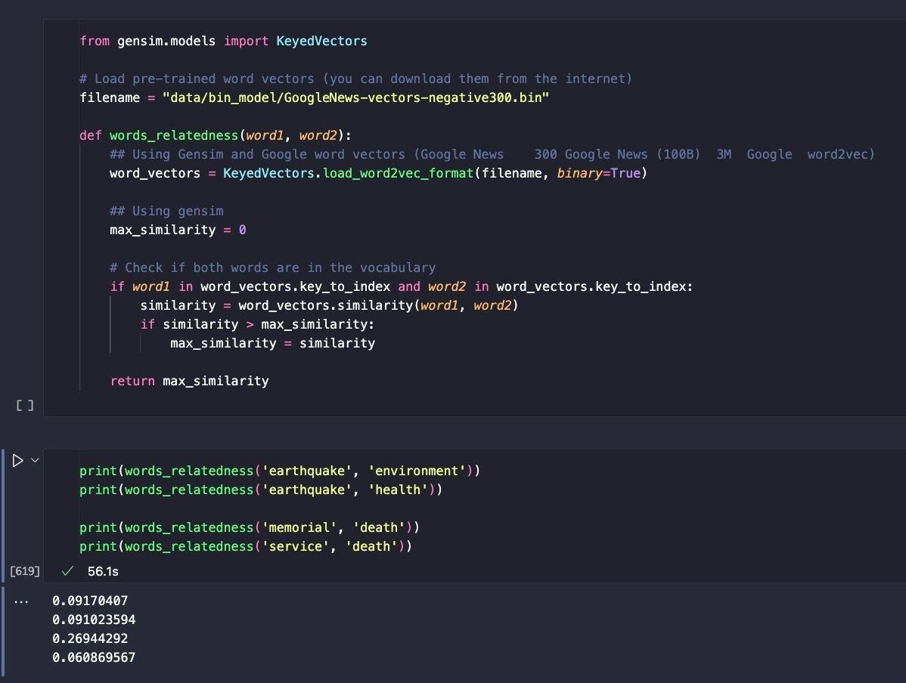
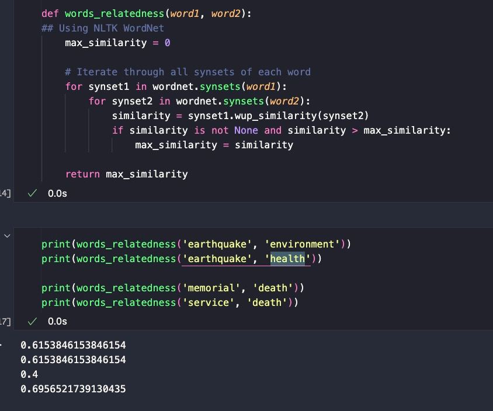

# 50.021 AI Project: Event Detection

This project aims to detect events given the title of a news article through the use of machine learning. The dataset used is the MAVEN: A Massive General Domain Event Detection Dataset ([MAVEN](https://github.com/THU-KEG/MAVEN-dataset)). By generating more features from the dataset and creating more accurate labels, we aim to improve the performance of the model in detecting events.

This project is part of the 50.021 Artificial Intelligence course at the Singapore University of Technology & Design.

## Problem Statement

The problem involves event detection in a general domain, utilising the MAVEN dataset. The objective is to develop a model capable of automatically identifying and categorising various events for news articles from the title.

Common problems faced in event detection include:

1. Context Detection: Difficult to accurately detect context in a limited amount of text.

2. Data Sparsity: Limited labelled datasets for specific domains. May have presence of missing or empty values in the dataset.

To address these challenges, we generated more features from the dataset and created more accurate labels. With a more well-defined dataset, we aim to improve the performance of our model in detecting events.

## Running the code

### Prerequisites

1. Ensure that you have a CSV file containing a column with the title of the news article. The title should be in the first column of the CSV file.

Example:
```csv
title
2006 Pangandaran earthquake and tsunami
Battle of Koromo River
2012–13 Ranji Trophy
The Barricades
Cyclone Larry
Electric Daisy Carnival
March 2015 North India unseasonal rain
Aktion Erntefest
Saint-Quentin-Fallavier attack
2014 Kunming attack
Operation Deliberate Force
Hurricane Madeline (1976)
NWEAMO
Darlington rail crash
...
```

2. Ensure that you have the following libraries installed:

```bash
conda install anaconda::pandas
conda install anaconda::nltk
conda install anaconda::scikit-learn
conda install conda-forge::tensorflow
conda install -c conda-forge spacy
conda install -c conda-forge cupy
python -m spacy download en_core_web_lg
```

3. Ensure that the following commands are run in your Python environment:

```bash
pip install -U evaluate
pip install -U datasets
pip install -U accelerate
pip install -U transformers
pip install -U scikit-learn
```

### How to Run

1. Prepare the dataset by running `src/stage_dataset.py`. You may need to modify the file path in the script to point to your dataset and output with your desired filename
   
2. With the output dataset, you may train a model using the following notebooks:
   - `albert.ipynb`
   - `ber-tiny.ipynb`
   - `roberta.ipynb`

### Project

- /data: Folder containing the dataset
- /images: Folder containing images used in the README
- eda_before.ipynb: Initial data exploration and analysis
- preprocessing_stage_data.py: Preprocessing the dataset, adds additional features and generates more accurate labels'
- eda_after.ipynb: Data exploration and analysis on the preprocessed dataset
- albert.ipynb: Model training and evaluation using the ALBERT model
- bert-tiny.ipynb: Model training and evaluation using the BERT-tiny model
- roberta.ipynb: Model training and evaluation using the RoBERTa model
  
## Data Exploration

For our project, we chose to focus only on the titles of news articles, aligning with our aim to develop a model that can accurately predict the nature of an article based on its title alone—the primary point of interaction for readers. This focus enhances efficiency in both model training and deployment, allowing us to address the challenge of accurately detecting context in the compact and impactful format of titles, which often lack detailed contextual clues.

We also identified that the existing labels in our dataset were inadequate for our specific needs. They lacked the descriptiveness and coherence necessary for robust model training, prompting us to create our own set of labels tailored to our model’s purpose. This strategic decision was further supported by the data sparsity encountered; the limited availability of uniformly labeled datasets and the presence of missing values in article bodies made titles a more reliable source of information.

By concentrating on titles and refining our labeling approach, we ensure that our training data is precisely aligned with our objectives. This approach allows us to develop a more focused and effective model, capable of categorizing news based on title content efficiently and with greater relevance to real-world reader interactions. This methodology not only meets our goal of enhancing predictive accuracy but also addresses practical limitations in data handling and computational resources.

## Data Preprocessing

### Generating new features

Upon receiving the dataset, containing the title of the news article, we generated more features from the dataset:

1. **Word Count**: The number of words in the title.
2. **Character Count**: The number of characters in the title.
3. **N-Grams**: Extracting n-grams (sequences of n words) from the title. This could capture patterns or phrases that are indicative of certain categories. Due to the short length of the titles, we decided to extract 2-grams (bigrams).
4. **Lemma**: The base form of the word.
5. **POS**: The simple UPOS part-of-speech tag. 
6. **Tag**: The detailed part-of-speech tag.
7. **Dependency**: The syntactic relation between words.
8. **TF-IDF**: Term Frequency-Inverse Document Frequency, a numerical statistic that is intended to reflect how important a word is to a document in a collection or corpus.
9. **Trigger Words**: Words that are indicative of certain categories. We created a list of trigger words for each category and checked if the title contained any of these words.

### Coherent and accurate categories

We also created more accurate labels for the dataset. The original dataset contained 142 categories, which were too broad and not descriptive enough. We selected categories that were commonly used to classify news articles and labelled the news articles with these categories by identifying the relationship between the title and the categories chosen.

The categories used are:

- business
- politics
- technology
- entertainment
- sports
- lifestyle
- health
- science
- education
- editorial
- international
- environment
- crime
- travel
- social

### Generating suitable trigger words

In order to accurately pair the titles with the most suitable category, we first generated trigger words for each news article. These trigger words were selected based on the POS tags of the words in the title, as well as the type of entity the words represented. In order to ensure the context of the news article was preserved, words in the title that belonged to the same entity were grouped together. In this manner, stop words were removed and the trigger words were generated.

Next, we generated the normalized TF-IDF score of each trigger word for each row. For trigger words that had multiple words, we calculated the average TF-IDF score of the words in the trigger word. Normalized values were used to ensure that the TF-IDF scores were comparable across different trigger words for the same row.

### Selecting the most suitable category

Finally, we selected the most suitable category for each row by comparing the similarities between the trigger words and the categories. The category with the highest similarity score was selected as the label for the row.

#### 1. Gensim

We first used the Gensim library to generate the similarity scores between the trigger words and the categories. We used the Word2Vec model to generate the similarity scores. The Word2Vec model was trained on the Google News dataset, which contained 300-dimensional word vectors. We used the cosine similarity to calculate the similarity scores between the trigger words and the categories.

However, the Word2Vec model was not able to generate accurate similarity scores for the trigger words and the categories. Futhermore, the runtime of the model was too long, which would have made it difficult to generate the similarity scores for the entire dataset.



#### 2. NLTK

We then used the NLTK library to generate the similarity scores between the trigger words and the categories. We used the synsets from the WordNet lexical database to generate the similarity scores. We calculated the similarity scores between the trigger words and the categories by comparing the synsets of the words in the trigger words and the categories.

Although the NLTK library was able to generate more accurate similarity scores for the trigger words and the categories at faster speeds, we felt that the accuracy of the similarity scores could be further improved. 



#### 3. Spacy

Finally, we used the Spacy library to generate the similarity scores between the trigger words and the categories. We made use of the `en_core_web_lg` model, which contained 685k keys, 685k unique vectors, 300 dimensions, and 685k vectors in total. We calculated the similarity scores between the trigger words and the categories by comparing the vectors of the words in the trigger words and the categories.

The Spacy library was able to generate the most accurate similarity scores for the trigger words and the categories at fast speeds. Hence, we used the Spacy library to generate the similarity scores for the entire dataset.


### Labelling the dataset

Knowing that the Spacy library was able to generate the most accurate similarity scores for the trigger words and the categories, we used the Spacy library to generate the similarity scores for the entire dataset. We selected the category with the highest similarity score as the label for each row.

However, to ensure that trigger words with low TF-IDF scores did not affect the category selection, we set a threshold for the TF-IDF scores of the trigger words that were considered in the category selection. We only considered the results of trigger words with high TF-IDF scores above the threshold in the category selection.

### Output

The following sample output is generated from the data preprocessing:

```
title,word_count,character_count,bigrams,lemma,pos,tag,dep,label,context_score,trigger_words,category

2006 Pangandaran earthquake and tsunami,5,39,"[('2006', 'Pangandaran'), ('Pangandaran', 'earthquake'), ('earthquake', 'and'), ('and', 'tsunami')]","['2006', 'Pangandaran', 'earthquake', 'and', 'tsunami']","['NUM', 'PROPN', 'NOUN', 'CCONJ', 'NOUN']","['CD', 'NNP', 'NN', 'CC', 'NN']","['nummod', 'compound', 'ROOT', 'cc', 'conj']","['DATE', '', '', '', '']","{'pangandaran': 0.04385272437177429, 'earthquake': 1.0, 'tsunami': 0.12392056153658368}","['pangandaran', 'earthquake', 'tsunami']",environment
```

It has also resulted in a dataset with more accurate labels and additional features:


## Model Training

### Model Selection
Fine-tuning a pre-trained model via transfer learning is a common approach in NLP tasks. We experimented with three transformer-based models: BERT-tiny, AlBERT, and RoBERTa. These models have been pre-trained on large corpora of text data and have been shown to achieve state-of-the-art performance in various NLP tasks.

#### BERT
BERT (Bidirectional Encoder Representations from Transformers) is a transformer-based model that uses a bidirectional approach to capture the context of words in a sentence. BERT has been pre-trained on a large corpus of text data and can be fine-tuned on specific tasks with additional labeled data. We fine-tuned the BERT-tiny variant on our dataset to predict the categories of news articles based on their titles and additional features as a baseline model.

#### AlBERT
ALBERT (A Lite BERT) is a variant of the BERT model that uses a parameter-reduction technique to reduce the number of parameters while maintaining the model's performance. We fine-tuned the ALBERT model on our dataset to see if it could achieve similar performance to BERT with fewer parameters.

#### RoBERTa
RoBERTa uses a more aggressive BPE algorithm compared to BERT, leading to a larger number of sub-word units and a more fine-grained representation of the language. We fine-tuned the RoBERTa model on our dataset to compare its performance with BERT-tiny and AlBERT.

### Model Training
We fine-tuned the BERT-tiny, AlBERT, and RoBERTa models on our preprocessed dataset. We used the Hugging Face Transformers library to load the pre-trained models and fine-tune them on our dataset. The code also does some pre-processing of the dataset in terms of tokenization and padding/truncating the title to a specific sequence that the BERT variants require. We trained all the models with a learning rate of 5e-5, a batch size of 16, a weight decay of 0.01 and dropout probabilities of 0.1 for hidden layer outputs and attention probabilities in the self-attention mechanism. We trained the model for 20 epochs and evaluated them on the validation set. AdamW optimizer with a linear learning rate scheduler was used to optimize the model parameters.

### Model Evaluation

#### Metrics
We evaluated the performance of the models on the test set using the F1 score, precision, and recall. The F1 score is the harmonic mean of precision and recall and provides a balanced measure of the model's performance. Precision measures the proportion of true positive predictions among all positive predictions, while recall measures the proportion of true positive predictions among all actual positive instances. We also calculated the accuracy of the models on the test set, which measures the proportion of correct predictions among all predictions.

### Results
The results of the model training and evaluation are as follows:

| Model     | F1 Score | Precision | Recall | Accuracy |
|-----------|----------|-----------|--------|----------|
| BERT-tiny | 0.798    | 0.783     | 0.818  | 0.818    |
| AlBERT    | 0.859    | 0.853     | 0.870  | 0.870    |
| RoBERTa   | 0.879    | 0.881     | 0.880  | 0.880    |

The RoBERTa model achieved the highest F1 score, precision, recall, and accuracy among the three models. The AlBERT model also performed well, with a slightly higher F1 score than BERT-tiny. The BERT-tiny model achieved a slightly lower F1 score than RoBERTa and AlBERT but still performed well overall.

### Conclusion
In conclusion, the RoBERTa model achieved the best performance on our dataset, with the highest F1 score, precision, recall, and accuracy. The AlBERT model also performed well, with a slightly higher F1 score than BERT-tiny. The BERT-tiny model achieved a slightly lower F1 score than RoBERTa and AlBERT but still performed well overall. Despite having fewer parameters, ALBERT achieves comparable or even better performance than BERT-tiny on this task, thanks to its efficient use of parameters and parameter sharing. 

## Future Work

1. **Data Augmentation**: We could explore data augmentation techniques to generate more training data and improve the model's performance. Techniques such as back-translation, synonym replacement, and word embedding could be used to augment the dataset and provide more diverse examples for the model to learn from.

2. **Hyperparameter Tuning**: We could further optimize the hyperparameters of the model to improve its performance. Techniques such as grid search, random search, and Bayesian optimization could be used to find the optimal hyperparameters for the model.

3. **Ensemble Methods**: We could explore ensemble methods to combine the predictions of multiple models and improve the overall performance. Techniques such as bagging, boosting, and stacking could be used to create an ensemble of models that work together to make more accurate predictions.

4. **BERT Variants**: We could experiment with other variants of the BERT model, such as ALBERT, ELECTRA, and GPT-3, to see if they provide better performance on our dataset. These models have different architectures and training objectives that could potentially improve the model's performance in event detection tasks.

## Built with

[Anaconda](https://www.anaconda.com/) - Virtual environment \
[Python](https://www.python.org/) - Programming language

## Authors

**Jobelle Lee** - [themaxermister](https://github.com/themaxermister) \
**Kenng Ong** - [cannotknee](https://github.com/cannotknee) \
**Xu Muzi** - [xl-M](hhttps://github.com/xl-Mu) \
**Song Cheongcheong** - [alicejungk](https://github.com/alicejungk)


