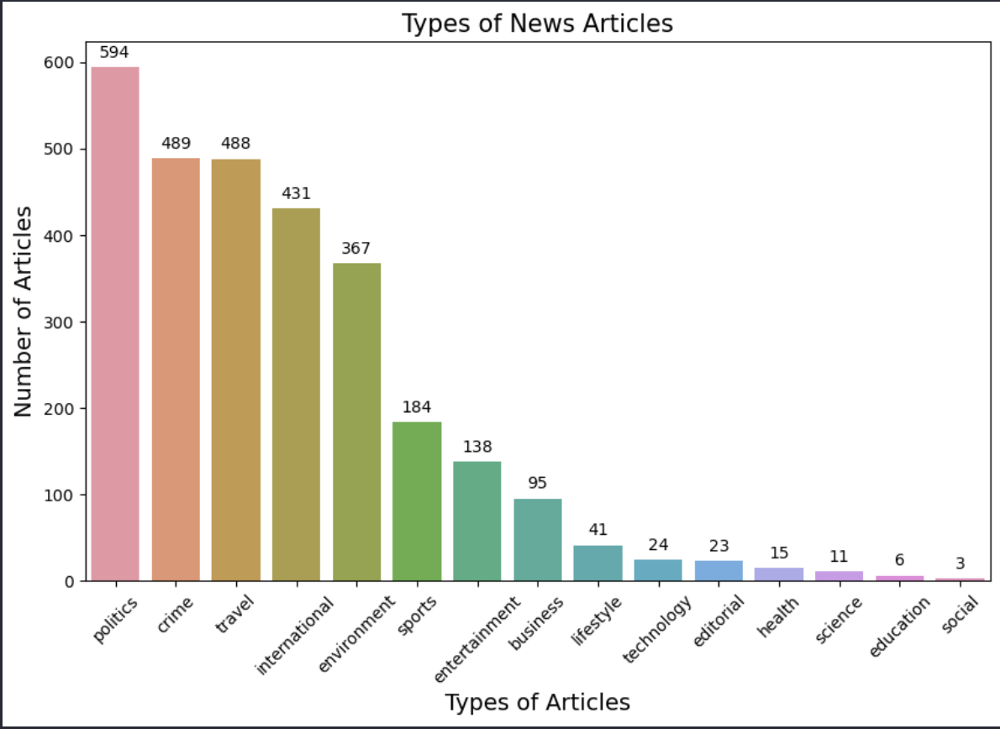

# 50.021 AI Project: Event Detection

This project aims to detect events given the title of a news article through the use of machine learning. The dataset used is the MAVEN: A Massive General Domain Event Detection Dataset ([MAVEN](https://github.com/THU-KEG/MAVEN-dataset)). By generating more features from the dataset and creating more accurate labels, we aim to improve the performance of the model in detecting events.

This project is part of the 50.021 Artificial Intelligence course at the School of Computing, National University of Singapore.

## Running the code

### Prerequisites

### How to Run

## Data Exploration (MuZi)

For the project, we chose to focus only on the titles of news articles. This decision aligns with our aim to create a model that can accurately predict the nature of an article based solely on its title, which is often the first point of interaction for readers.

The existing labels were found to be inadequate for our specific needs; they lacked the descriptiveness and coherence required for robust model training. Therefore, we decided to create our own set of labels that are tailored to our model’s purpose, enhancing the relevance and accuracy of the predictions.

This approach allows us to develop a more focused and efficient model that aligns with our objectives of categorizing news based on title content effectively.
## Data Preprocessing

### Generating new features

Upon receiving the dataset, containing the title of the news article, we generated more features from the dataset:

1. **Word Count**: The number of words in the title.
2. **Character Count**: The number of characters in the title.
3. **N-Grams**: Extracting n-grams (sequences of n words) from the title. This could capture patterns or phrases that are indicative of certain categories. Due to the short length of the titles, we decided to extract 2-grams (bigrams).
4. **Lemma**: The base form of the word.
5. **POS**: The simple UPOS part-of-speech tag. 
6. **Tag**: The detailed part-of-speech tag.
7. **Dependency**: The syntactic relation between words.
8. **TF-IDF**: Term Frequency-Inverse Document Frequency, a numerical statistic that is intended to reflect how important a word is to a document in a collection or corpus.
9. **Trigger Words**: Words that are indicative of certain categories. We created a list of trigger words for each category and checked if the title contained any of these words.

### Coherent and accurate categories

We also created more accurate labels for the dataset. The original dataset contained 142 categories, which were too broad and not descriptive enough. We selected categories that were commonly used to classify news articles and labelled the news articles with these categories by identifying the relationship between the title and the categories chosen.

The categories used are:

- business
- politics
- technology
- entertainment
- sports
- lifestyle
- health
- science
- education
- editorial
- international
- environment
- crime
- travel
- social

### Generating suitable trigger words

In order to accurately pair the titles with the most suitable category, we first generated trigger words for each news article. These trigger words were selected based on the POS tags of the words in the title, as well as the type of entity the words represented. In order to ensure the context of the news article was preserved, words in the title that belonged to the same entity were grouped together. In this manner, stop words were removed and the trigger words were generated.

Next, we generated the normalized TF-IDF score of each trigger word for each row. For trigger words that had multiple words, we calculated the average TF-IDF score of the words in the trigger word. Normalized values were used to ensure that the TF-IDF scores were comparable across different trigger words for the same row.

### Selecting the most suitable category

Finally, we selected the most suitable category for each row by comparing the similarities between the trigger words and the categories. The category with the highest similarity score was selected as the label for the row.

#### 1. Gensim

We first used the Gensim library to generate the similarity scores between the trigger words and the categories. We used the Word2Vec model to generate the similarity scores. The Word2Vec model was trained on the Google News dataset, which contained 300-dimensional word vectors. We used the cosine similarity to calculate the similarity scores between the trigger words and the categories.

However, the Word2Vec model was not able to generate accurate similarity scores for the trigger words and the categories. Futhermore, the runtime of the model was too long, which would have made it difficult to generate the similarity scores for the entire dataset.

#### 2. NLTK

We then used the NLTK library to generate the similarity scores between the trigger words and the categories. We used the synsets from the WordNet lexical database to generate the similarity scores. We calculated the similarity scores between the trigger words and the categories by comparing the synsets of the words in the trigger words and the categories.

Although the NLTK library was able to generate more accurate similarity scores for the trigger words and the categories at faster speeds, we felt that the accuracy of the similarity scores could be further improved. 

#### 3. Spacy

Finally, we used the Spacy library to generate the similarity scores between the trigger words and the categories. We made use of the `en_core_web_lg` model, which contained 685k keys, 685k unique vectors, 300 dimensions, and 685k vectors in total. We calculated the similarity scores between the trigger words and the categories by comparing the vectors of the words in the trigger words and the categories.

The Spacy library was able to generate the most accurate similarity scores for the trigger words and the categories at fast speeds. Hence, we used the Spacy library to generate the similarity scores for the entire dataset.

### Labelling the dataset

Knowing that the Spacy library was able to generate the most accurate similarity scores for the trigger words and the categories, we used the Spacy library to generate the similarity scores for the entire dataset. We selected the category with the highest similarity score as the label for each row.

However, to ensure that trigger words with low TF-IDF scores did not affect the category selection, we set a threshold for the TF-IDF scores of the trigger words that were considered in the category selection. We only considered the results of trigger words with high TF-IDF scores above the threshold in the category selection.

### Output

The following sample output is generated from the data preprocessing:

```
title,word_count,character_count,bigrams,lemma,pos,tag,dep,label,context_score,trigger_words,category

2006 Pangandaran earthquake and tsunami,5,39,"[('2006', 'Pangandaran'), ('Pangandaran', 'earthquake'), ('earthquake', 'and'), ('and', 'tsunami')]","['2006', 'Pangandaran', 'earthquake', 'and', 'tsunami']","['NUM', 'PROPN', 'NOUN', 'CCONJ', 'NOUN']","['CD', 'NNP', 'NN', 'CC', 'NN']","['nummod', 'compound', 'ROOT', 'cc', 'conj']","['DATE', '', '', '', '']","{'pangandaran': 0.04385272437177429, 'earthquake': 1.0, 'tsunami': 0.12392056153658368}","['pangandaran', 'earthquake', 'tsunami']",environment
```

It has also resulted in a dataset with more accurate labels and additional features:



## The Model (Kenny)

# Project Overview

## Built with

[Anaconda](https://www.anaconda.com/) - Virtual environment \
[Python](https://www.python.org/) - Programming language

## Authors

**Jobelle Lee** - [themaxermister](https://github.com/themaxermister) \
**Kenng Ong** - [cannotknee](https://github.com/cannotknee) \
**Xu Muzi** - [xl-M](hhttps://github.com/xl-Mu) \
**Song Cheongcheong** - [alicejungk](https://github.com/alicejungk)


